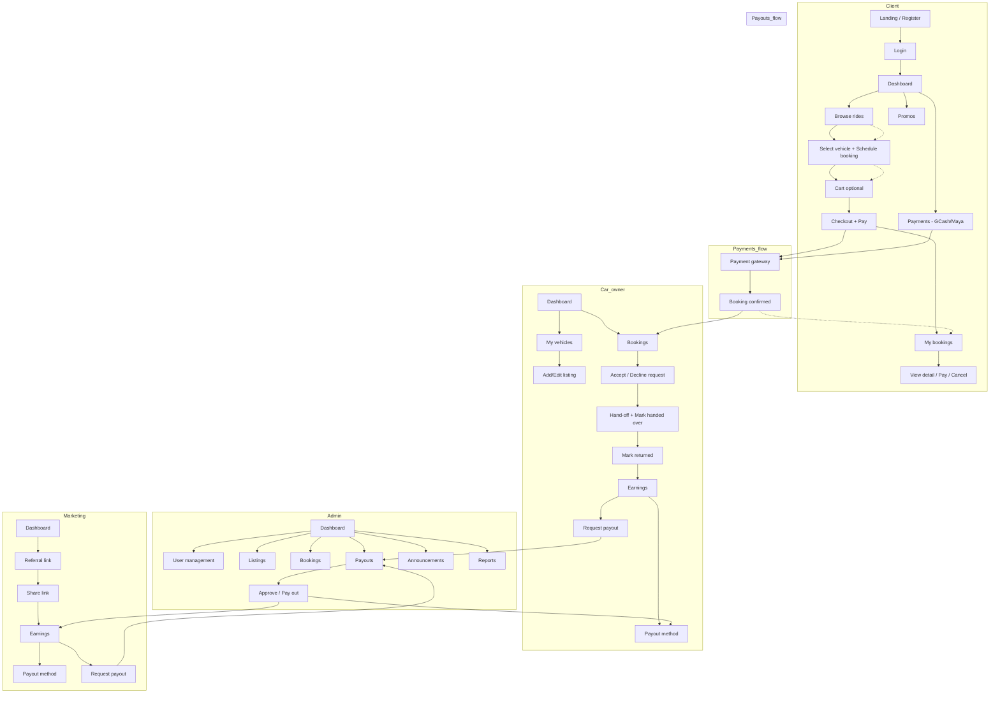
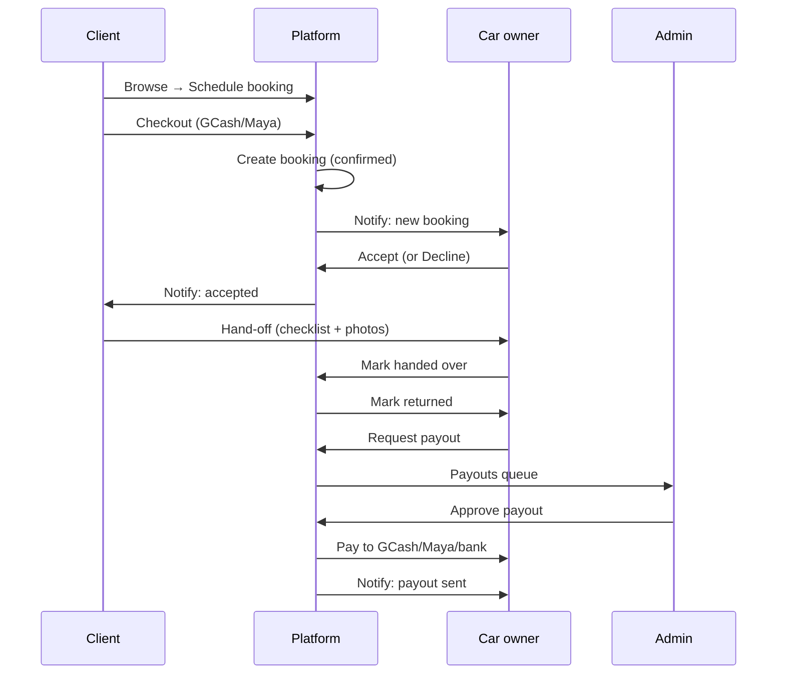

# BulodPH – Pages, Functions & Flow (Suggestions)

This document summarizes **existing** pages per role, **suggested** new pages (e.g. Payments, Cart, Schedule booking), **detailed functions** per role, and a **flowchart** of how everything interacts.

---

## 1. Current state (existing pages)

| Role | Route | Page | Status | Notes |
|------|--------|------|--------|-------|
| **Client** | `/client` | Dashboard | ✅ Role content | Hero, stats, quick links |
| | `/client/browse` | Browse rides | ⚠️ Placeholder | Needs: search, filters, vehicle cards, Book |
| | `/client/bookings` | My bookings | ⚠️ Placeholder | Needs: list upcoming/past, status, pay/cancel |
| | `/client/promo` | Promos | ⚠️ Placeholder | Promo codes, BULOD30 |
| **Car owner** | `/car-owner` | Dashboard | ✅ Role content | Hero, stats, quick links |
| | `/car-owner/vehicles` | My vehicles | ⚠️ Placeholder | Needs: list, add/edit, availability, price |
| | `/car-owner/bookings` | Bookings | ⚠️ Placeholder | Hand-offs, accept/decline, mark returned |
| | `/car-owner/earnings` | Earnings | ⚠️ Placeholder | Balance, payout method, request payout |
| **Marketing** | `/marketing` | Dashboard | ✅ Role content | Hero, stats, quick links |
| | `/marketing/referral` | Referral link | ⚠️ Placeholder | Unique link, share, copy |
| | `/marketing/campaigns` | Campaigns | ⚠️ Placeholder | Active campaigns, materials |
| | `/marketing/earnings` | Earnings | ⚠️ Placeholder | Referral earnings, payout |
| | `/marketing/resources` | Resources | ⚠️ Placeholder | Logos, key messages |
| **Admin** | `/admin` | Dashboard | ✅ Role content | Stats, charts, quick links |
| | User management → | Car owners, Clients, Marketing staff | ✅ CRUD | List, add, edit, delete |
| | `/admin/listings` | Listings | ⚠️ Placeholder | All vehicles, approve/feature |
| | `/admin/bookings` | Bookings | ⚠️ Placeholder | All bookings, status, refund |
| | `/admin/payouts` | Payouts | ⚠️ Placeholder | Payout requests, approve/pay |
| | `/announcements` | Announcements | ✅ Implemented | Compose, send, sent list |
| | `/reports` | Reports | ✅ BulodPH content | Booking stats, revenue, templates |
| **All** | `/settings` | Settings | ✅ Exists | Preferences, security |

---

## 2. Suggested new pages (and where to add them)

### 2.1 Payments / Payment methods (all paying roles)

**Who:** Client, Car owner, Marketing partner (anyone who pays or receives money).

| Role | Suggested route | Purpose |
|------|------------------|--------|
| **Client** | `/client/payments` | Link GCash/Maya (and optionally bank) for **paying** for bookings. View saved methods, set default, remove. |
| **Car owner** | `/car-owner/payout-method` or under **Earnings** | Link GCash/Maya/bank for **receiving** payouts. Required before first payout. |
| **Marketing** | `/marketing/payout-method` or under **Earnings** | Same as car owner – where to receive referral payouts. |
| **Admin** | No separate page | Payouts page already handles “who to pay”; payment method is on the recipient’s side. |

**Suggested functions (Payments page – Client):**
- List saved payment methods (e.g. GCash ending 1234, Maya ending 5678).
- Add method: choose GCash or Maya → enter mobile number → verify (OTP or “send code”).
- Set default method for auto-payment at checkout.
- Remove method.
- Optional: billing history (what was charged for which booking).

**Suggested functions (Payout method – Car owner / Marketing):**
- Single form or card: “Receive payouts via” → GCash / Maya / Bank.
- Enter account number (or mobile for e-wallet), account name; optional: branch/account type for bank.
- “Verify” or “Save” – store encrypted; show masked (e.g. ****1234).
- Show “Next payout date” or “Request payout” from same page or Earnings.

---

### 2.2 Cart / Checkout (Client only)

**Who:** Client (renter).

**Suggested routes:**
- `/client/cart` – Cart (optional if you support multi-day or multi-vehicle in one flow).
- `/client/checkout` or inline in **Browse** – “Book now” → date/time → review → pay.

**Suggested flow (simplest – no cart):**
1. **Browse** → pick vehicle → **Book now**.
2. **Schedule booking** (see below) → pick dates, optional add-ons (e.g. extra driver, insurance).
3. **Review** (summary: vehicle, dates, price, promo if any).
4. **Pay** → choose saved GCash/Maya or add one → confirm → booking created (pending_payment or confirmed depending on payment flow).

**If you add a cart:**
- “Add to cart” on Browse → Cart lists items (vehicle + dates) → “Proceed to checkout” → same review + pay.
- Useful if you later support “book multiple vehicles” or “save for later”.

**Suggested functions:**
- Add to cart: vehicle ID, start/end date-time, computed price (or price per day × days).
- Cart: list items, edit dates, remove item, total, “Proceed to checkout”.
- Checkout: apply promo code, select payment method, confirm → create booking + charge (or “pay at hand-off” if you support it).

---

### 2.3 Schedule a booking (Client + Car owner + Admin)

**Who:** Client (creates booking), Car owner (sees/accepts), Admin (oversees).

**Where it lives:**
- **Client:** Part of **Browse** flow: “Book now” → **Schedule** step (dates, time, meet-up preference) → then Review → Pay. Optionally a dedicated `/client/bookings/new` or “Schedule a booking” from Dashboard.
- **Car owner:** No “schedule” page per se – they see **Bookings** with requested/confirmed dates and Accept / Decline / Mark hand-off / Mark returned.
- **Admin:** **Bookings** list; can “Create booking” (e.g. for support) linking client + vehicle + dates.

**Suggested functions – Client (Schedule step):**
- Select vehicle (from Browse or from “Schedule a booking”).
- Pick **start date & time** and **end date & time** (or “number of days”).
- Pick **meet-up location** (e.g. owner’s address, Cauayan pickup) or “I’ll message the owner”.
- See **price summary**: daily rate × days, optional fees, promo discount, total.
- “Continue to payment” or “Request booking” (if you do request-first, then pay on accept).

**Suggested functions – Car owner (Bookings page):**
- List: **Requested** (pending accept), **Confirmed** (upcoming), **Active** (handed off), **Completed**, **Cancelled**.
- Actions: **Accept** / **Decline** request; **Mark handed over** (with optional checklist/photos); **Mark returned**; **Report issue**.
- Filter by vehicle, date range.

**Suggested functions – Admin (Bookings page):**
- List all bookings; filter by status, client, owner, date.
- View detail; **Cancel**; **Refund**; **Mark completed** (or sync from owner action); **Assign support** (if you add tickets).

---

### 2.4 Other suggested pages (short)

| Page | Role | Route idea | Purpose |
|------|------|------------|--------|
| **Booking detail** | Client, Car owner, Admin | `/client/bookings/:id`, `/car-owner/bookings/:id`, `/admin/bookings/:id` | Single booking: dates, vehicle, other party, status, payments, actions (pay, cancel, hand-off, refund). |
| **Vehicle detail** | Client, Admin | `/client/browse/:id` or modal | Full listing: photos, specs, price, availability, “Book now”. |
| **Add / Edit vehicle** | Car owner | `/car-owner/vehicles/new`, `/car-owner/vehicles/:id/edit` | Form: photos, type, location, price/day, availability calendar. |
| **Profile** | All | `/profile` or `/settings` | Name, phone, address, ID/license upload (for verification). |
| **Notifications** | All | `/notifications` or drawer | List of notifications (booking accepted, payment received, payout sent, etc.). |
| **Help / FAQ** | All | `/help` or link to external | How to book, how to list, payouts, contact. |

---

## 3. Detailed functions by role

### 3.1 Client (Renter / Pasahero)

| Function | Description | Where |
|----------|-------------|--------|
| **Browse vehicles** | Search/filter by location (e.g. Cauayan, Ilagan), vehicle type (car), dates. List cards with photo, name, price/day, “Book now”. | Browse rides |
| **View vehicle detail** | Full listing: gallery, specs, owner (masked or name), price, calendar of availability. | Browse (detail or modal) |
| **Schedule a booking** | Select dates and time, meet-up option, see price breakdown. | Browse flow or My bookings → New |
| **Add to cart** (optional) | Add one or more “vehicle + dates” to cart; edit/remove; go to checkout. | Cart page |
| **Checkout & pay** | Review order, apply promo, choose GCash/Maya, confirm; create booking and charge. | Checkout or inline after Schedule |
| **Manage payment methods** | Add/remove GCash or Maya; set default for auto-payment. | Payments page |
| **My bookings** | List upcoming and past; filter by status. View detail, pay (if pending), cancel (if allowed). | My bookings |
| **View booking detail** | Dates, vehicle, owner contact, status, payment summary, receipt. Actions: Pay, Cancel. | Booking detail |
| **Use promos** | Enter code (e.g. BULOD30) at checkout; see discount applied. | Promos page + Checkout |
| **Profile / verification** | Edit name, phone; upload ID/LTO for “Verified by BulodPH”. | Settings / Profile |

---

### 3.2 Car owner (Host / Kadua)

| Function | Description | Where |
|----------|-------------|--------|
| **List vehicles** | Add car: photos, type, location, price per day, availability. | My vehicles |
| **Edit / pause vehicle** | Edit details; set status Available / Unavailable / Paused. | My vehicles |
| **View bookings** | List requested, confirmed, active, completed. Accept/decline; mark hand-off and return. | Bookings |
| **Hand-off flow** | Checklist + photos at hand-off; mark “Handed over” so trip starts. | Bookings (detail) |
| **Return flow** | Checklist + photos at return; mark “Returned”; optional damage report. | Bookings (detail) |
| **Earnings** | See balance (pending, available), history by trip; “Request payout” or see next payout date. | Earnings |
| **Payout method** | Set GCash/Maya/bank for receiving payouts; required before first payout. | Earnings or Payout method page |
| **Profile / verification** | Same as client; “Verified by BulodPH” when documents approved. | Settings / Profile |

---

### 3.3 Marketing partner

| Function | Description | Where |
|----------|-------------|--------|
| **Referral link** | Copy unique link; share (social, WhatsApp). See clicks/sign-ups if tracked. | Referral link |
| **Campaigns** | List active campaigns; performance (clicks, sign-ups, earnings); share or get materials. | Campaigns |
| **Earnings** | Referral earnings by period; balance; “Request payout” or next payout date. | Earnings |
| **Payout method** | Set where to receive referral payouts (GCash/Maya/bank). | Earnings or Payout method |
| **Resources** | Download logos, key messages, sample posts. | Resources |

---

### 3.4 Admin

| Function | Description | Where |
|----------|-------------|--------|
| **User management** | List Car owners, Clients, Marketing staff; add, edit, suspend, delete. | User management (sidebar) |
| **Listings** | All vehicles; approve, feature, hide, contact owner. | Listings |
| **Bookings** | All bookings; view, cancel, refund, mark completed; optional “Create booking”. | Bookings |
| **Payouts** | Payout requests from owners + marketing; approve, mark paid, or reject. | Payouts |
| **Announcements** | Send email to everyone or by role (renters, owners, marketing). | Announcements |
| **Reports** | Booking stats, revenue, export; report templates. | Reports |
| **Platform settings** | Promo codes (e.g. BULOD30), landing content, FAQ; optional feature flags. | Settings or dedicated Admin settings |

---

## 4. Flowchart – how it all interacts

High-level flow: **Client** browses → schedules → pays → **Car owner** accepts → hand-off → return → **payouts** (and **Marketing** referrals in parallel). **Admin** oversees and pays out.

---

## 5. Simplified user-journey flowchart (booking + payment + payout)

---

## 6. Suggested implementation order

1. **Client**
   - Build **Browse** (list + filters + vehicle detail).
   - Add **Schedule booking** (dates, time, summary) and **Checkout** (payment method, confirm).
   - Add **Payments** page (GCash/Maya).
   - Then **My bookings** (list + detail + pay/cancel).

2. **Car owner**
   - Build **My vehicles** (list + add/edit).
   - Build **Bookings** (list + accept/decline + hand-off/return).
   - Add **Earnings** (balance + history) and **Payout method** (GCash/Maya/bank).
   - **Request payout** from Earnings.

3. **Marketing**
   - Build **Referral link** (copy, share).
   - **Earnings** + **Payout method** + **Request payout**.

4. **Admin**
   - Turn **Listings**, **Bookings**, **Payouts** from placeholders into real lists and actions (approve payout, refund, etc.).
   - Optional: **Create booking** (support), **Promo codes** in settings.

5. **Cross-cutting**
   - **Notifications** (in-app or email) for booking and payout events.
   - **Profile / verification** (ID, LTO) for Client and Car owner.

---

## 7. Summary table – pages to add

| Page | Client | Car owner | Marketing | Admin |
|------|--------|-----------|-----------|--------|
| **Payments / Payout method** | ✅ Add `/client/payments` | ✅ In Earnings or `/car-owner/payout-method` | ✅ In Earnings or `/marketing/payout-method` | — |
| **Cart** | ✅ Optional `/client/cart` | — | — | — |
| **Schedule booking** | ✅ In Browse flow or `/client/bookings/new` | — (has Bookings) | — | Optional in Bookings |
| **Booking detail** | ✅ `/client/bookings/:id` | ✅ `/car-owner/bookings/:id` | — | ✅ `/admin/bookings/:id` |
| **Vehicle detail** | ✅ In Browse | — (has My vehicles) | — | In Listings |
| **Add/Edit vehicle** | — | ✅ `/car-owner/vehicles/new`, `:id/edit` | — | — |
| **Profile** | ✅ `/profile` or Settings | ✅ | ✅ | ✅ |
| **Notifications** | ✅ All | ✅ | ✅ | ✅ |

Use this document to align front-end routes and components with backend APIs (bookings, payments, payouts) and to implement the flows step by step.
